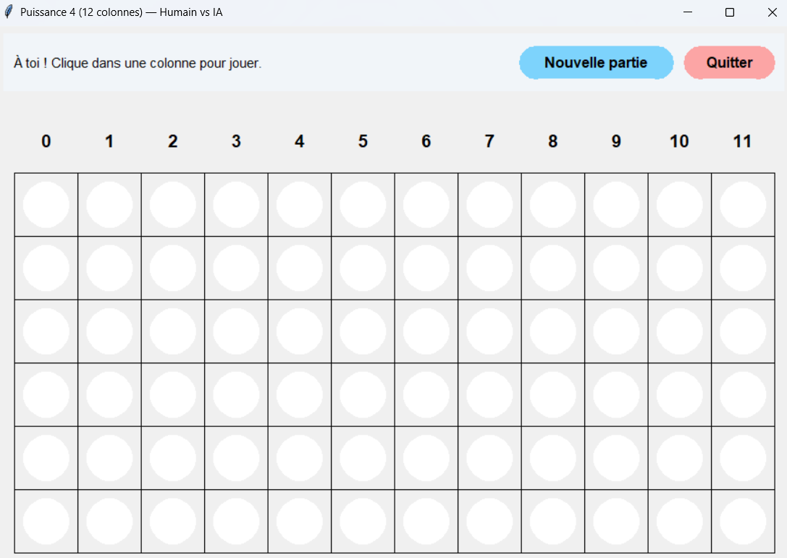
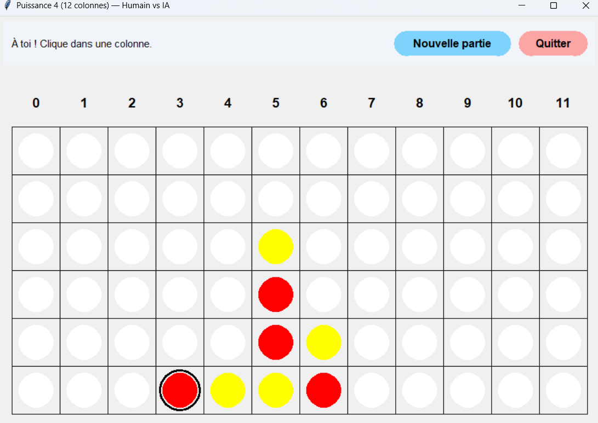

# Puissance 4 — Humain vs IA (Alpha-Bêta)

Projet personnel en **Python** : un jeu de **Puissance 4** avec une **interface graphique Tkinter** et une **IA basée sur l’algorithme Minimax avec élagage alpha-bêta**.

Ce projet a été réalisé dans un objectif d’apprentissage (algorithmique, IA classique et interface graphique).


## Fonctionnalités

- Grille **6 × 12**
- Joueur humain vs Intelligence artificielle
- IA utilisant :
  - Minimax
  - Élagage alpha-bêta
  - Fonction heuristique
- Clic possible **n’importe où dans une colonne**
- Interface graphique Tkinter
- Bouton *Nouvelle partie*
- Bouton *Quitter*


## Aperçu du jeu

### Début de partie


### Partie en cours



## Lancer le jeu

### Prérequis
- Python **3.9+**
- Tkinter (généralement inclus avec Python)

### Exécution
```bash
python Puissance4_ui.py
